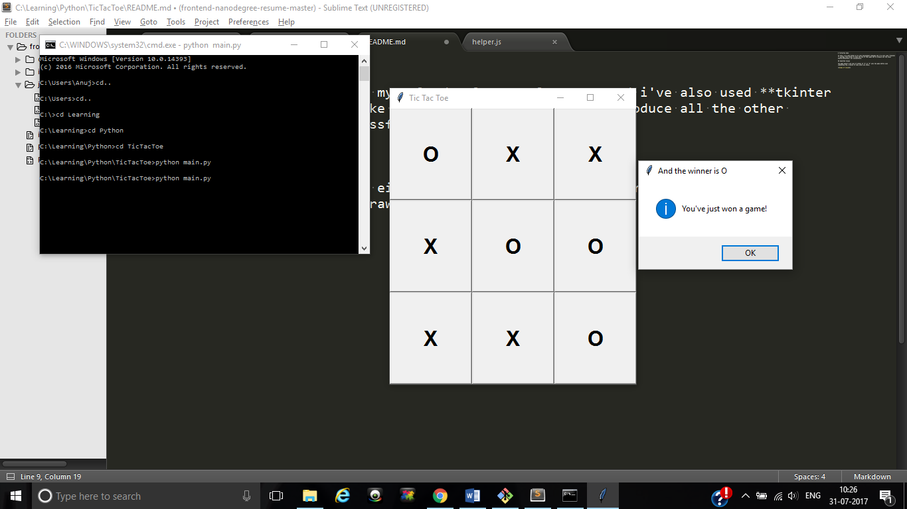
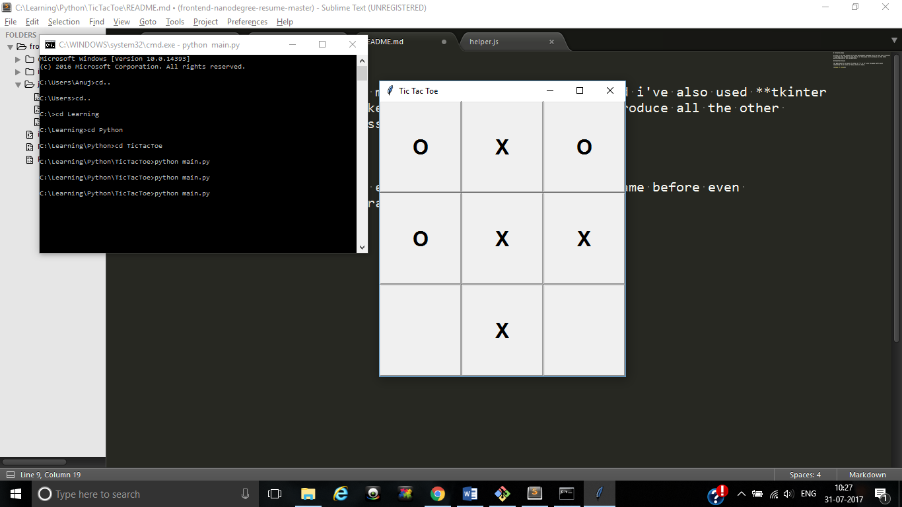

# TicTacToe Game

In this, i've used Python as my sole development language and i've also used **tkinter** package from python to make the GUI of this game and to produce all the other alerts,characters, etc successfully.

## Reported Issues

The game doesn't end even if either of "X" or "O" wins the game before even completing the 9 blocks of draw which are there.

